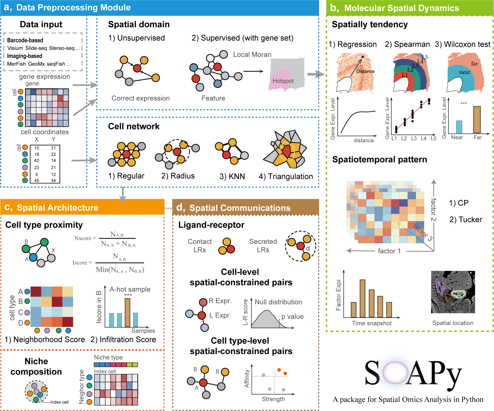

# SOAPy: A package for **S**patial-**O**mics **A**nalysis in **Py**thon

<div align=left></div>

## Brief Introduction
**SOAPy** is an integrated toolkit that focuses on addressing spatial heterogeneity. SOAPy contains four data
preprocessing modules (“Data Import”, “spatial network”, and “Spatial Domain”), three modules for analyzing spatial
expression patterns of genes (“Spatial Variation”, “Spatial Tendency”, and “Spatiotemporal Pattern”), two modules
for analyzing the spatial architecture of cells (“Spatial Proximity”, “Spatial Composition”), and two module for
analyzing Spatial Communication.

## Pipeline

<div align=center></div>

## Installation
pip:
```
    pip install SOAPy-st
```
github:
```
    cd SOAPy-st
    python setup.py build
    python setup.py install
```
