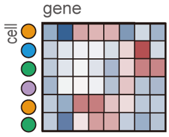
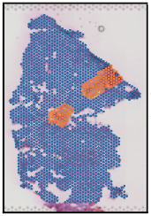
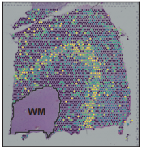
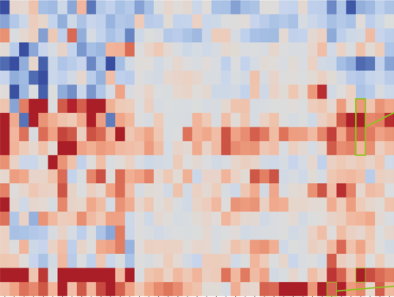
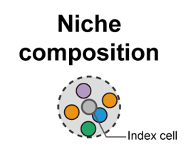
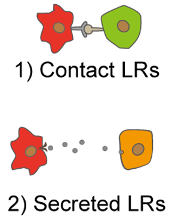
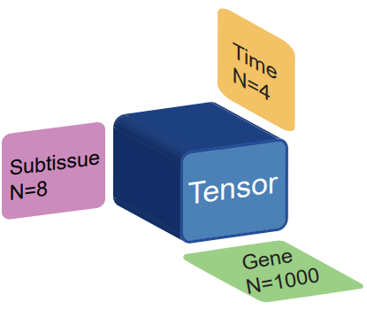

.. module:: SOAPy_st
.. automodule:: SOAPy_st
   :noindex:

Tutorials
======================================

Examples data
-------------

Some of the processed h5ad data will be uploaded to the https://zenodo.org/records/10450764 for direct use by the user,
and other non-uploaded data can be downloaded through the links given in the tutorial.

Major tutorials
---------------

.. toctree::
    :maxdepth: 1

    Read_spatial_omics

.. toctree::
    :maxdepth: 1

    Spatial domain

.. toctree::
    :maxdepth: 1

    Spatial tendency

.. toctree::
    :maxdepth: 1

    Cell type proximity

.. toctree::
    :maxdepth: 1

    Niche composition

.. toctree::
    :maxdepth: 1

    Spatial communications

.. toctree::
    :maxdepth: 1

    Spatiotemporal pattern

Other tutorials
---------------

.. toctree::
    :maxdepth: 1

    Transfer Seurat object into Anndata object
    Visualization of Nanostring DSP subtissues
    Spatial communication - cell level
