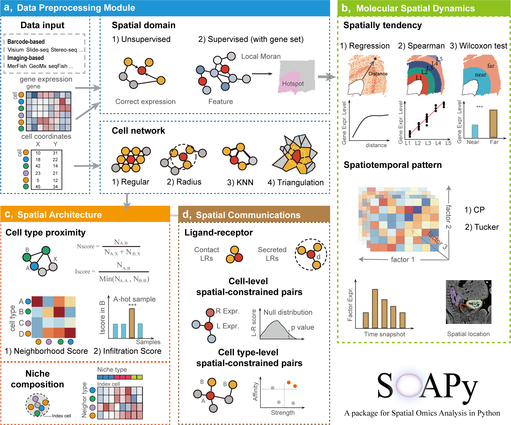

.. soapy documentation master file, created by
   sphinx-quickstart on Sun Dec  3 22:27:33 2023.
   You can adapt this file completely to your liking, but it should at least
   contain the root `toctree` directive.

SOAPy - Spatial Omics Analysis in Python
====================================================

|PyPI| |PyPIDownloads| |Docs|

.. |PyPI| image:: https://img.shields.io/pypi/v/SOAPy_st?logo=PyPI
   :target: https://pypi.org/project/SOAPy_st
.. |PyPIDownloads| image:: https://pepy.tech/badge/SOAPy_st
   :target: https://pepy.tech/project/SOAPy_st

**SOAPy** is an integrated toolkit that focuses on addressing spatial heterogeneity. SOAPy contains four data
preprocessing modules (“Data Import”, “spatial network”, and “Spatial Domain”), three modules for analyzing spatial
expression patterns of genes (“Spatial Variation”, “Spatial Tendency”, and “Spatiotemporal Pattern”), two modules
for analyzing the spatial architecture of cells (“Spatial Proximity”, “Spatial Composition”), and two module for
analyzing Spatial Communication.

.. toctree::
   :maxdepth: 2
   :caption: Contents:

   Installation
   Tutorials/index
   Api/index
   Release_notes
   References

Indices and tables
==================

* :ref:`genindex`
* :ref:`modindex`
* :ref:`search`
